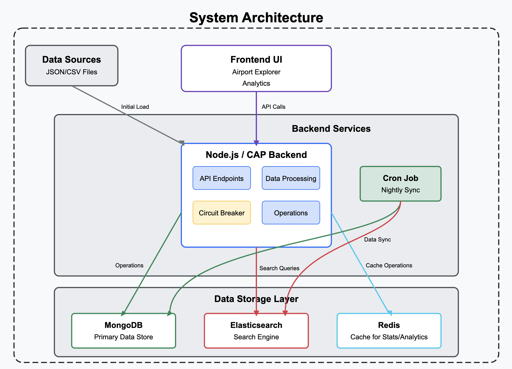
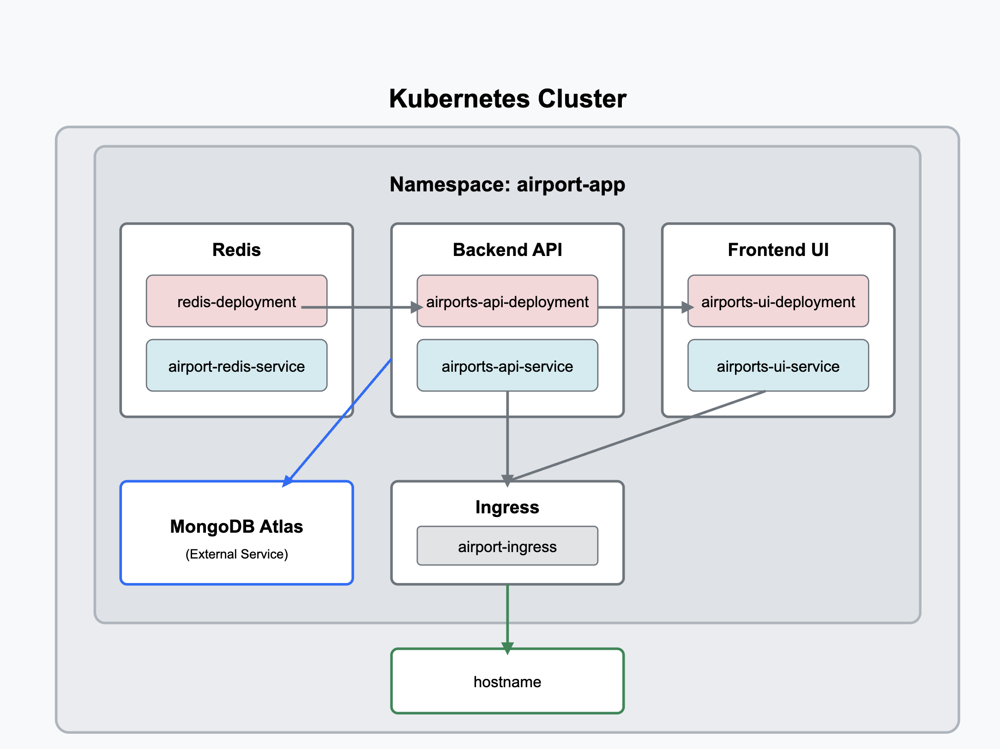
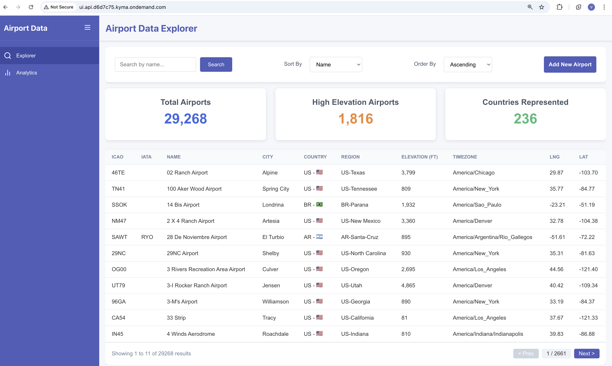
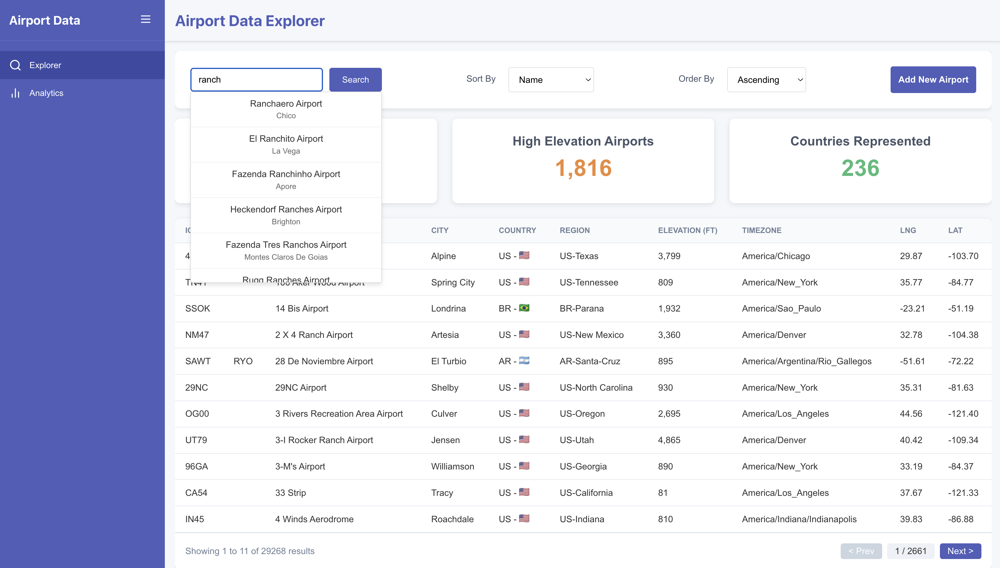
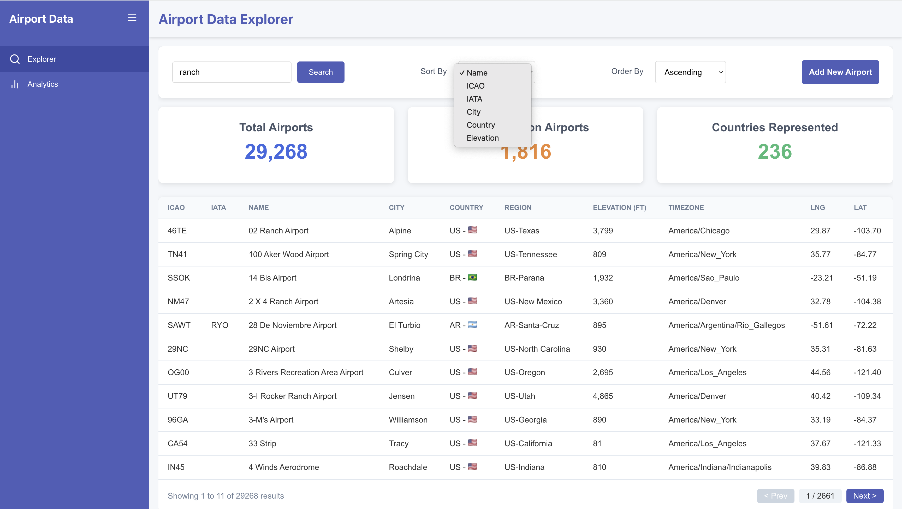
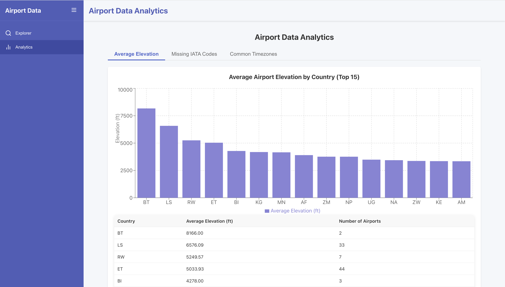
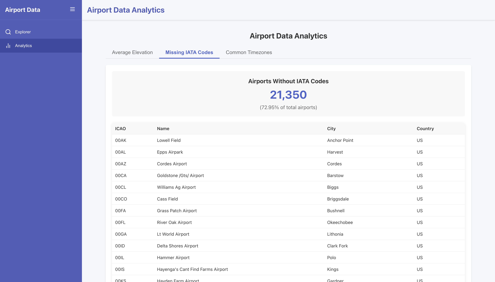
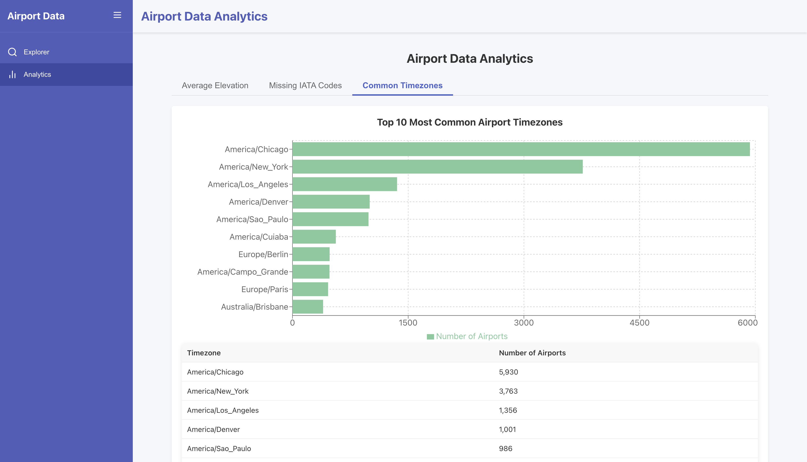

# ✈️ Airlytics

A full-stack application that provides an interactive API and web interface to explore global airport data. The service is powered by Node.js / CAP, backed by MongoDB and Elasticsearch, and deployed on the SAP BTP Kyma Kubernetes cluster.

## 🌍 Live Demo

- **Frontend App URL:** [ui.api.d6d7c75.kyma.ondemand.com](https://ui.api.d6d7c75.kyma.ondemand.com)  
  _If it doesn't open properly in **Chrome**, try using **Safari**._
- **API Base URL:** [api.api.d6d7c75.kyma.ondemand.com/](api.api.d6d7c75.kyma.ondemand.com/)
- **Swagger Documentation:** [api.api.d6d7c75.kyma.ondemand.com/api-docs](api.api.d6d7c75.kyma.ondemand.com/api-docs)

## 🎥 Video Demo

[Video demo Link](https://drive.google.com/file/d/1DfOmEUQ_0XXcWRVoM7tWn2bySvfA8Tf6/view?usp=sharing)

---
##  Architecture Diagarm



## 🔄 Data Flow and Components


### 📂 Data Sources

- **Initial Data Source**: JSON/CSV files containing detailed airport information.


### 🖥️ Frontend UI

- Airport Explorer.
- Analytics


### 🧠 Backend

- Core API endpoints for retrieving, filtering, sorting and adding airport data
- Data processing module for enrichment (like deriving region from country/state)
-  operations for managing airport data
- **Circuit breaker pattern** to handle failover between Elasticsearch and MongoDB


### 🗃️ Data Storage Layer

- **MongoDB**: Primary data store for airport information.
- **Elasticsearch**: High-performance search engine for efficient text-based filtering.
- **Redis**: Used as a cache for storing:
  - Analytics
  - Statistics
  - Frequently accessed data


### ⏱️ Background Processes

- A **cron job** runs nightly to:
  - Synchronize data between **MongoDB** and **Elasticsearch**
  - Maintain consistency across the data storage layers


### 🏗️ Key Architectural Patterns

- **🧯 Circuit Breaker Pattern**: Enables graceful fallback to MongoDB when Elasticsearch is unavailable.
- **⚡ Caching Strategy**: Uses Redis to serve analytics and frequently used statistics with low latency.
- **📅 Scheduled Synchronization**: Ensures data consistency by syncing MongoDB and Elasticsearch every night.
- **📈 Data Flow**: Captures the complete lifecycle — from initial load (via JSON/CSV) to API-level interactions and caching.


---

## 🧱 Tech Stack

| Layer          | Technology           |
|----------------|----------------------|
| **Frontend**   | React (or other)     |
| **Backend**    | Node.js + Express and CAP   |
| **Database**   | MongoDB              |
| **Search Engine** | Elasticsearch     |
| **Caching**    | Redis                |
| **Unit Test**  | Jest                |
| **Cron Jobs**  | node-cron            |
| **Deployment** | SAP BTP (Kayma)   |
  

---

## 🔩 Components

| Component        | Description                                                                 |
|------------------|-----------------------------------------------------------------------------|
| 👤 **User (UI)** | Front-facing interface for querying & viewing results                       |
| 🖥️ **Frontend**   | Built using React (or any modern JS framework)                             |
| 🔧 **Backend**    | Node.js + Express handles routing, API logic, and integration and CAP      |
| 🗃️ **MongoDB**     | Primary data store for airport records                                     |
| 🧠 **Elasticsearch** | Search engine for fast full-text search & autocomplete                   |
| 🔁 **Circuit Breaker** | Graceful fallback to Mongo when ES is down                            |
| 🧪 **Redis**      | Caches airport stats for performance                                       |
| ⏰ **Cron Job**    | Nightly sync job to update Elasticsearch with Mongo data                   |
| ☁️ **SAP BTP**     |  Deployment on kyma cluster using SAP Business Technology Platform          |

---
## ⚙️ Features

### Backend (Node.js + Express + MongoDB + Elasticsearch)
🚀 Features
- Load & display 29K+ airports from JSON/CSV into MongoDB

- Fast search & filtering using Elasticsearch

- Fallback to MongoDB using Circuit Breaker when ES is down

- Nightly sync job from MongoDB to Elasticsearch via Cron

- Derived fields like region (Country-State)

- Sorting & filtering by name, city, country, etc.

- Add airport at runtime via API

- Highlight rows in UI where elevation > 8000ft

- Caching stats/analytics in Redis

- Deployment on SAP BTP

### Frontend (React.js)
- Displays all airports in a table view
- Sortable and filterable by columns
- Highlights rows where elevation > 8000 ft

## 🔍 Data Analytics & Scripting Tasks

This application includes various analytical endpoints and background tasks that provide valuable insights on airport data.

### 🚀 Performance Features
- 🗂️ **Redis Caching**: Frequently accessed analytics results are cached in Redis to boost performance and reduce latency.
- 🕐 **Nightly Cron Job**: A scheduled task syncs data from **MongoDB** to **Elasticsearch** every night to ensure search results stay up to date.

### 📈 Scripting Tasks

1. **Calculate Average Elevation per Country**
   - Computes the average airport elevation grouped by country.
   - Helpful for geographic analysis and environmental studies.

2. **Find Airports Without IATA Codes**
   - Detects airports missing an IATA code.
   - Useful for data quality assurance and cleanup.

3. **Determine the 10 Most Common Time Zones**
   - Lists the most frequently occurring airport time zones.
   - Helps understand global distribution and timezone density.

Each of these is exposed via clean REST APIs and efficiently cached with Redis for production-grade speed.

---
## Deployment Digaram


## 🧩 Components

### 🔙 Backend API

- **Image**: `vipul710/airport-backend:dev`
- **Port**: `8080`
- **Dependencies**:
  - MongoDB Atlas
  - Redis

### 🖥️ Frontend UI

- **Image**: `vipul710/airports-ui:dev`
- **Port**: `3000`
- **Communicates with**: Backend API

### 🧠 Redis Cache

- **Image**: `redis:latest`
- **Port**: `6379`
- **Used for**: Caching frequently accessed data

## 📦 Deployment Instructions

1. Make sure you have access to a running Kubernetes cluster.
2. Apply the Kubernetes manifests:

kubectl apply -f k8s/deployment.yaml


## ⚙️ Configuration

The application uses the following environment variables:

| Variable      | Description                           |
|---------------|---------------------------------------|
| `MONGO_URI`   | Connection string for MongoDB Atlas   |
| `REDIS_HOST`  | Hostname for Redis service            |
| `REDIS_PORT`  | Port for Redis service (default: 6379)|

---

## ⚙️ Setup Instructions

Follow these steps to run the project locally:

---

### 1. 📦 Clone the Repository

```bash
git clone git@github.com:Vipul-0722/IR-Project.git
cd frontend
```

```bash
npm install
npm start
```


2. 🚀 Backend Setup
   
```bash
cd backend/api-server
npm install
docker run -d --name redis-server -p 6379:6379 redis
node index.js
```
Create a .env file  and add the following:

```bash  
MONGO_URI=<your-mongodb-uri>
ELASTIC_URI=<your-elasticsearch-host>
REDIS_URL=redis://localhost:6379
```
---
## 📸 Screenshots

### 🏠 Home Page


### 🔍 Autocomplete Search 


### 🔍 Sort By filter 


### 🔍 Analytics - Average Elevation per Country


### 🔍 Analytics - Airports Without IATA Codes


### 🔍 Analytics - 10 Most Common Time Zones

